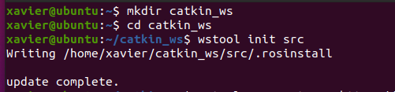
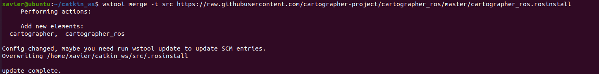
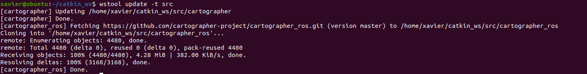
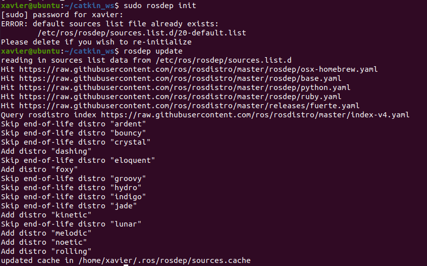
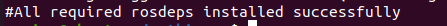

# SLAM_Cartographer
Ubuntu 20.04+ROS_Noetic+Cartographer+EAIX4Lidar+JY901 and more

## 配置环境

### Ubuntu 的安装

默认使用的是 VM 虚拟机 +[Ubuntu 20.04](https://ubuntu.com/download/desktop) 的组合

尝试过Rasspbery Pi 4B + [Ubuntu mate 20.04_Release](https://releases.ubuntu-mate.org/20.04/armhf/) or [offical site](https://ubuntu-mate.org/download/arm64/focal/) 和 [Ubuntu 18.04.5 LTS (Bionic Beaver)](http://cdimage.ubuntu.com/releases/18.04/release/)

- [x] 推荐使用: **ubuntu-mate-20.04.1-desktop-arm64+raspi.img.xz**
  1. 有mate轻量级桌面
  2. wifi好配置
  3. 支持ROS noetic

- [ ] 如果使用 **ubuntu-18.04.5-preinstalled-server-arm64+raspi4.img.xz** 
  1. Console 操作，需要额外安装桌
  2. wifi配置复杂，最好使用网线连接
  3. ROS melodic or kinetic

:warning::warning::warning:**不要使用最新的21.04版本 无论是国外源 还是国内的 阿里云和高校镜像 都没有ROS的Release 文件**

*其他建议：*

1. :fire:*最好给树梅派安排个风扇控制温度, 使用下面的命令可以获取CPU温度 (value/1000 单位℃)*:thermometer::

   > cd /sys/class/thermal/thermal_zone0
   >
   > cat temp

 2. :fast_forward:*使用至少32G的高速SD卡 或者外接USB,硬盘启动,注意是否需要额外供电:electric_plug:*

 3. :signal_strength:*Ubuntu server 配置wifi 以及安装界面* 

    > #yaml 文件名称可能有所差异
    >
    > sudo vim /etc/netplan/50-cloud-init.yaml
    
    > #修改yaml文件如下：
    > network:
    >    version: 2
    >    ethernets:
    > 	………………(此处不用修改已省略）
    >    wifis:
    >        wlan0:
    >            dhcp4: true
    >            access-points:
    >                "wifi名称":
    >                    password: "wifi密码"
    >
    > #注意 wifis和 ethernets对齐 如果输入正确 关键词都会染色高亮
    
    > #调试配置文件，如果输入错误会有报错，根据报错修改
    > sudo netplan try
    > #应用配置文件
    > sudo netplan apply
    > #执行完这一步 wifi就应该连接成功了
    
    > #更新系统 并安装Ubuntu界面 （耗时较长）也可以选择其他图形化界面比如：mate
    > sudo apt-get update 
    > sudo apt-get dist-upgrade -y 
    > sudo apt-get install ubuntu-desktop -y

###   ROS的安装

1. 参考[官方教程](http://wiki.ros.org/noetic/Installation/Ubuntu), 默认安装 ROS noetic 版本,不同版本在安装时需要注意修改commands 中的版本名称:

   > #将commands 中的 :
   >
   > ${ROS_DISTRO} 
   >
   > #替换成对应的版本名 kinetic || melodic  || noetic

2. 获取source.list 和 Key,推荐使用默认的源(即下方命令行),可能需要科学上网，[其他镜像](http://wiki.ros.org/ROS/Installation/UbuntuMirrors)

   > sudo sh -c 'echo "deb http://packages.ros.org/ros/ubuntu $(lsb_release -sc) main" > /etc/apt/sources.list.d/ros-latest.list'
   >
   > sudo apt-key adv --keyserver 'hkp://keyserver.ubuntu.com:80' --recv-key C1CF6E31E6BADE8868B172B4F42ED6FBAB17C654
   >
   > sudo apt update
   >
   > #安装完整的ROS 如果有特殊需求 参考官方教程
   >
   > sudo apt install ros-noetic-desktop-full

​	:warning:此处可能会提示无法找到Release 文件，考虑切换源，或更换推荐的Ubuntu及ROS版本

3. 路径脚本

   > #在每个要运行ROS程序的console 都要使用如下命令行
   >
   > source /opt/ros/noetic/setup.bash
   >
   > #一劳永逸
   >
   > echo "source /opt/ros/noetic/setup.bash" >> ~/.bashrc
   > source ~/.bashrc

4. 安装依赖项

   > sudo apt install python3-rosdep python3-rosinstall python3-rosinstall-generator python3-wstool build-essential
   >
   > sudo apt install python3-rosdep

5. 初始化并更新

   :warning:如果此处进行过 init操作,安装Cartographer时就不要再重复了,会报错

   > sudo rosdep init
   > rosdep update

6. 确认脚本

   > #用 gvim|| vim||nano 等编辑器打开脚本
   >
   > sudo gvim ~/.bashrc
   >
   > #脚本最后应该有
   >
   > source /opt/ros/noetic/setup.bash
   >
   > #运行脚本
   >
   > source ~/.bashrc

   ### Cartographer 安装及编译

   参考:[官方教程](https://google-cartographer-ros.readthedocs.io/en/latest/compilation.html#)

   1. 安装依赖项

      > sudo apt-get update
      >
      > sudo apt-get install -y python-wstool python-rosdep ninja-build stow

   2. 创建工作环境

      > #建立一个子目录。参数：-p 确保目录名称存在，如果目录不存在的就新创建一个。
      >
      > mkdir catkin_ws
      > cd catkin_ws
      > wstool init src
      
      

   3. 获取source
   

      > wstool merge -t src https://raw.githubusercontent.com/cartographer-project/cartographer_ros/master/cartographer_ros.rosinstall
      > wstool update -t src
      >
      > #如果出现fatal：Failed to connect to github.com port 443: connection refused，是因为要科学上网

      

   4. 安装rosdep

      

      > #安装ROS时initialize过会报错，可以无视
      >
      > sudo rosdep init
      >
      > rosdep update
      >
      > #这里下载时间较长
      > #rosdep install --from-paths src --ignore-src --rosdistro=noetic -y
      >
      > rosdep install --from-paths src --ignore-src --rosdistro=${ROS_DISTRO} -y 
      >
      > #安装完成显示：#All required rosdeps installed successfully

      

   5. 安装abseil-cpp

      > src/cartographer/scripts/install_abseil.sh
      >
      > #你**可能**需要删除ros自带的abseil-app防止冲突
      > #sudo apt-get remove ros-${ROS_DISTRO}-abseil-cpp
      > #ex:sudo apt-get remove ros-noetic-abseil-cpp

   6. 编译

      :warning::warning::warning:最重要最关键的一步,编译过程较为缓慢

      > catkin_make_isolated --install --use-ninja

      :warning::warning::warning: 一定要使用上面的命令行编译Cartographer 所在的工作环境, 在将来增添了雷达，IMU等驱动之后,也要使用此命令行,不然会报cmake的相关错误

      

   7. 添加环境

      > #在每个运行Cartographer程序的console 都要使用如下命令行
      >
      > source install_isolated/setup.bash
      >
      > #或者 ~/.bashrc 文件中添加 注意对应地址
      >
      > source ~/catkin_ws/install_isolated/setup.bash

